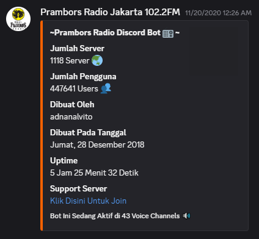

# 🎵 Prambors Discord Bot

Prambors Discord Bot is a **Discord bot** that allows users to listen to **Radio Prambors Jakarta 102.2FM** directly from Discord without opening a browser tab.  

This project is one of my **earliest coding projects** and played a major role in keeping me active in programming.  

 <!-- replace with your image if available -->

---

## ✨ Background Story

I first created this bot in **2018**, when I was in **9th grade (Junior High School)**.  

At that time, I wanted to **bring Radio Prambors from the website to Discord** because opening a Chrome tab to listen to the radio was **too heavy on my PC**, especially when I was gaming.  

The code might look simple now—but remember, it was written by a middle schooler **learning only from StackOverflow and YouTube tutorials**.  

Initially, this bot was **for personal use** with my friends in a private Discord server. However, it quickly gained interest and eventually:

- 📌 Deployed in **1,118 Discord servers**  
- 👥 Used by **447,000 Discord users** across all servers  

---

## 💡 Key Features

- 🎧 Listen to **Radio Prambors live** directly on Discord  
- 📈 Tracks server and user statistics  
- 🔗 Clickable linking to Discord server invite
- 🎵 Search and view **song lyrics** using Genius API
- 🤖 Lightweight and simple to use  

---

## ⚡ Commands

The bot supports the following commands:

| Command | Description |
|---------|-------------|
| `!prambors info` | Menampilkan informasi tentang bot ini |
| `!prambors help` | Menampilkan seluruh command |
| `!prambors play` | Bot akan join voice channel kamu dan mulai streaming Radio Prambors |
| `!prambors leave` | Membuat bot keluar dari voice channel |
| `!prambors lirik <judul>` | Mencari lirik suatu musik menggunakan **Genius API** |
| `!prambors invite` | Memberikan invite link bot |
| `!prambors jadwal` | Menampilkan jadwal show list Prambors Radio Jakarta |
| `!prambors ping` | Menampilkan ping bot |

---

## 🎓 What I Learned

Through developing Prambors Discord Bot, I gained experience in:

- **Building a Discord bot** with Node.js and Discord.js  
- **Integrating external APIs** such as Genius for song lyrics  
- **Web scraping** using `axios` and `cheerio`  
- **Deploying and maintaining a live bot** across multiple servers  
- **Writing code for real-world use cases**, starting from a personal project to one used by thousands of users  
- **Problem-solving and debugging** based on user feedback

---

## 🧰 Tech Stack

---
